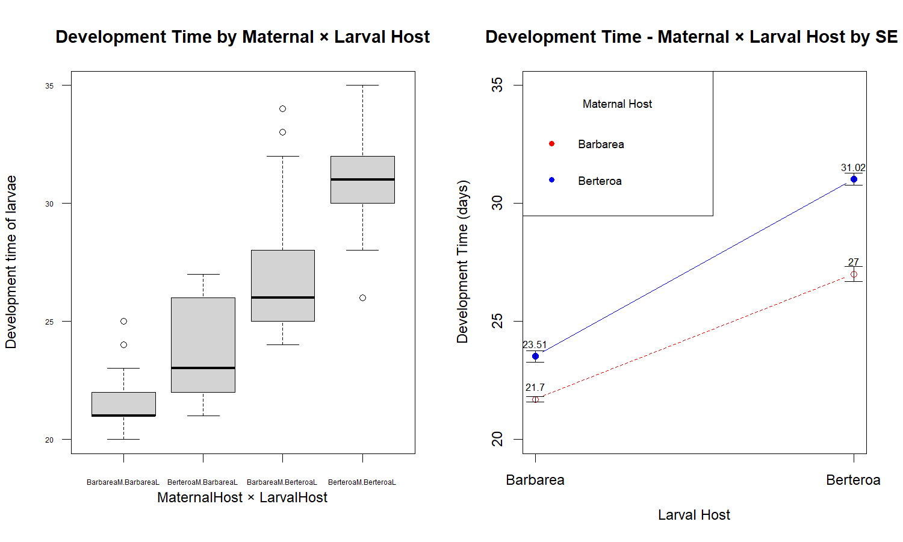
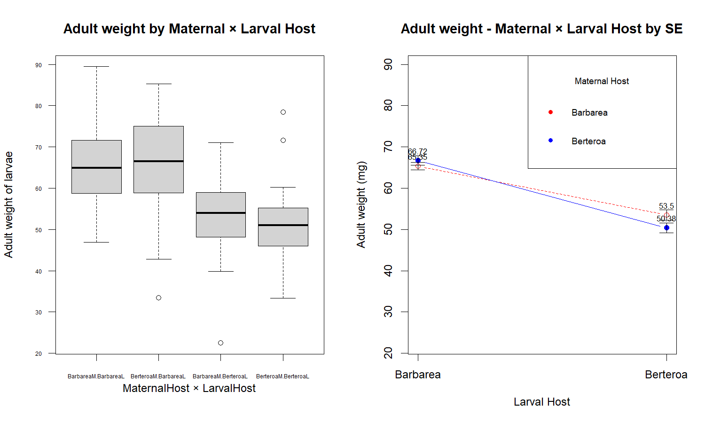
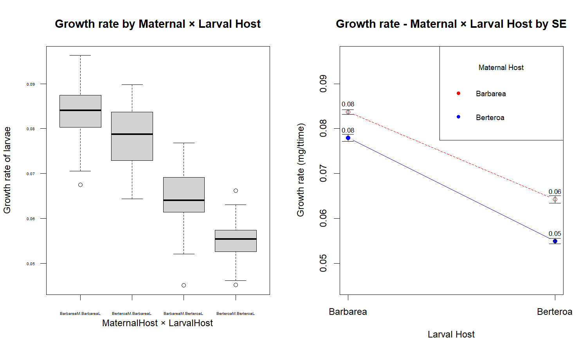

**Title:** ***Effects of Maternal and Larval Host on Butterfly Development.***

**Introduction:**

The Butterfly life cycle is complex which starts from egg to mature adult butterfy. In this life cycle, the larvae's growth depend on the host plant for initial survival and development into pupa. The oviposition of female butterfly also affects the larvae's phenotypic trait, independent of larvae's genotype.

To understand the growth of the larvae's with respective to the host plant and oviposit of adult female butterfies, we undertaken two host plant *Barbarae* and *Berteroa*, where the female butterflies were grown and some oviposit on the same host plants and others oviposit on different host plant from where they reared.

The data were collected based on Maternal host and Larval host, with response variable like development time, Growth rate and Adult weight of the larvae. This separation helps us to address do maternal or larval host plant has high effect or the interaction of maternal and larval contribute towards the growth of the larvae.

To statistically evaluate the effects of host plant on the larvae growth, the linear model was used. Linear model helps to know how the response variables were affected by the independent factors, maternal and larval host here. Followed by linear regression model, the two-way ANOVA test was done to test the significance of each factors with respect to the response variables. By this, the larvae growth were studied on effect of maternal and larval host.

**Materials and Methods:**

The Two-way ANOVA was done for various response variables like development time, adult weight and growth rate, to understand how different host has effect on it. We initially, used Linear model, with factors, by
```
xi = Bo + B1(group level1) + B2(group level2) + residuals
```
where Bo is the reference group level mean, used to compare with other other groups, B1 and B2 are the difference between group1 & 2 mean and Bo. Residuals were understand from the linear model as difference of observed from predicted value. From the linear model the variation in the group mean helps us to identify the significance and role of factor towards the response variable.
This was studied by,
```
F = Mean square between groups/Mean square within groups (residuals)
```
In basic, the sum square tells us the variation between the group level and the residuals, the mean square were average of these variations. The Higher F-value indicates variation explained by the factor is large relative to the unexplained variation, suggesting that the factor significantly affects the response. 

**Results:**

*Group means:*

The mean of groups of each factors were calculated to understand the variation between and within the groups. This is done without profiling of interaction of maternal and larval host. The figure 1 shows the box plot, gives an overall idea on the each variables mean and their outliers, this will be first step in understanding the how the groups affects the response variable without knowing their factor interaction or significance.

In development time, the larvae reared on the Berteroa takes more time, while Barbarea feed larvae has higher weight and similarly, larvae reared on Barbarea has high growth rate.


Figure 1: Average of each group (between and within) of individual factors.

*Development time:*

From the table 1, that both maternal (f-value = 177.90) and larval host (f-value = 765.21) significantly influenced larvae development time, and the interactions (f-value = 23.05) was also significant with p-value < 0.001. This shows that larval host contribute to high variation.

**Table1**
|Response        |Factor                    |Df |Sum_Sq |Mean_Sq |F_value |p_value  |Significance |
|:---------------|:-------------------------|--:|------:|-------:|-------:|:--------|:------------|
|DevelopmentTime |MaternalHost              |  1| 623.61| 623.61 | 177.90 |0.000000 |***          |
|DevelopmentTime |LarvalHost                |  1|2682.41|2682.41 | 765.21 |0.000000 |***          |
|DevelopmentTime |MaternalHost:LarvalHost   |  1|  80.80|  80.80 |  23.05 |0.000003 |***          |

*Notes:*

Signif. codes: 0 '\*\*\*' 0.001 '\*\*' 0.01 '\*' 0.05 '.' 0.1 ' ' 1

From Figure 2, it is evident that the interaction group means of developmental time were lower for larvae reared on Barbarea compared to those reared on Berteroa, across both maternal and larval host-plant factors.


Figure 2: The developmental time of maternal and larval host interaction. The values mention in the plot were mean of each interaction. Both the plot explains the average of each interaction, but the right one shows the standard error of each mean.

*Adult weight:*

For adult weight, larval host has strong significant effect (f-value = 144.89), whereas maternal host had no significant effect (f-value = 0.82, p-value = 0.366). 

**Table2**
|Response   |Factor                    |Df |Sum_Sq  |Mean_Sq  |F_value |p_value  |Significance |
|:----------|:-------------------------|--:|-------:|--------:|-------:|:--------|:------------|
|AdultWeight|MaternalHost              |  1|   73.70|   73.70 |  0.82  |0.366    |             |
|AdultWeight|LarvalHost                |  1|13019.80|13019.80 |144.89  |0.000    |***          |
|AdultWeight|MaternalHost:LarvalHost   |  1|  336.70|  336.70 |  3.75  |0.054    |.           |

*Notes:*

Signif. codes: 0 '\*\*\*' 0.001 '\*\*' 0.01 '\*' 0.05 '.' 0.1 ' ' 1

Larvae feed on the Barbarea has higher weight compared to the Berteroa, then as we now that the maternal has no significant effect, the the larvae is independent of maternal host even reared on maternal's Barbarea. The figure 3, boxplot and interaction of maternal vs larval host of adult weight, shows it clearly that Barbarea fed larvae has high weight.


Figure 4: The adult weight of maternal and larval host interaction. The values mention in the plot were mean of each interaction. Both the plot explains the average of each interaction, but the right one shows the standard error of each mean.

*Growth rate:*

Both maternal and larval host were significantly affected larval growth with f-value of 133.4552 and 843.0077 (p-value < 0.001). Then the interaction with a f-value of 5.8621 with 0.016 p-value significant.

**Table3**
|Response   |Factor                    |Df |Sum_Sq   |Mean_Sq   |F_value |p_value  |Significance |
|:----------|:-------------------------|--:|--------:|---------:|-------:|:--------|:------------|
|GrowthRate |MaternalHost              |  1|0.00473  |0.00473   |133.46  |0.000    |***          |
|GrowthRate |LarvalHost                |  1|0.02991  |0.02991   |843.01  |0.000    |***          |
|GrowthRate |MaternalHost:LarvalHost   |  1|0.00021  |0.00021   |  5.86  |0.016    |*           |

*Notes:*

Signif. codes: 0 '\*\*\*' 0.001 '\*\*' 0.01 '\*' 0.05 '.' 0.1 ' ' 1

From figure 4, Growth rate was high at the Barabarea compared to Berteroa, particularly the growth rate was higher when the Barbarea was reared by the mother too. 


Figure 4: The growth rate of maternal and larval host interaction. The values mention in the plot were mean of each interaction. Both the plot explains the average of each interaction, but the right one shows the standard error of each mean.

The significant interaction shows that both maternal and larval host affects growth, with non-addictive effect.

**Conclusion:**

In whole, the ANOVA analyses demonstrate that the various response variables has significant on interaction of maternal and larval host. In indicate that the larvae growth depend on both the hosts. 

In adult weight, eventhough the maternal is insignificant, but the combination effect has minimal significance of p = 0.054. Then it also suggest that weight depends on the nutritional environment which larvae get from the barbarea.

Similarly in the growth rate, both maternal and larval interaction was significant, which suggest that both host environment helps in shaping the growth of the larvae.

Overall, the highest contributer to the variation was larval host, among all response variable. This provide a clear information that changes or collapse in the larval host environment eventually affect the larvae growth. But the significance of interaction helps to convey the non-additive effect of each others.

**R code:**
```
                        """ANOVA TEST"""
                        
# The script works for performing ANOVA test on the butterflies data;
# The butterfly's larvae reared on the maternal and larval host were studied;
# To understand, how the growth of larvae is affected by the host plants;

# Step1: extract the data;
# If the files in other directory, mention the directory first;
data_1 = read.csv('butterflies.csv')

# Step2: to distinguish between the maternal and larval host;
data_1$MaternalHost = paste0(data_1$MaternalHost, 'M')
data_1$LarvalHost = paste0(data_1$LarvalHost, 'L')

# Step3: to visualize the deviation within and between the group levels of each factors;
# Setting the grid for multiple plots;
layout(matrix(c(1,1,2,3), 2, 2, byrow = TRUE))
# For development time;
Development_all = c(data_1$DevelopmentTime, data_1$DevelopmentTime)
factors_all = factor(c(data_1$MaternalHost, data_1$LarvalHost), levels = c('BarbareaM', 'BerteroaM', 'BarbareaL', 'BerteroaL'))
boxplot(Development_all ~ factors_all, xlab = 'Group level of Maternal & Larval',
        ylab = 'Developmental Time', main = 'Deviation between & within Groups')

# For Adult weight;
weight_all = c(data_1$AdultWeight, data_1$AdultWeight)
factors_all = factor(c(data_1$MaternalHost, data_1$LarvalHost), levels = c('BarbareaM', 'BerteroaM', 'BarbareaL', 'BerteroaL'))
boxplot( weight_all~ factors_all, xlab = 'Group level of Maternal & Larval',
        ylab = 'Adult weight', main = 'Deviation between & within Groups')

# For growth rate;
growth_all = c(data_1$GrowthRate, data_1$GrowthRate)
factors_all = factor(c(data_1$MaternalHost, data_1$LarvalHost), levels = c('BarbareaM', 'BerteroaM', 'BarbareaL', 'BerteroaL'))
boxplot(growth_all ~ factors_all, xlab = 'Group level of Maternal & Larval',
        ylab = 'Growth rate',main = 'Deviation between & within Groups')

# Step4i: identify the mean of response variables;
# For development time;
dev_means = tapply(data_1$DevelopmentTime,
                   list(data_1$MaternalHost, data_1$LarvalHost),mean)
# Step5i: indentifying the standard error;
# Function to calculate standard error
se = function(x) {
  sd(x) / sqrt(length(x))
}
# Compute standard errors for development time;
dev_se = tapply(data_1$DevelopmentTime, 
                list(data_1$MaternalHost, data_1$LarvalHost), se)

# Step6i: AVOVA test;
# For development time;
model_dev = lm(DevelopmentTime~MaternalHost*LarvalHost, data = data_1)

#set the grid;
par(mfrow=c(1,2))
# For Development time-boxplot;
# Looking for the combination of Maternal x Larval Host;
boxplot(DevelopmentTime ~ MaternalHost * LarvalHost, data = data_1,
        cex.axis = 0.5, las = 1,
        xlab = '',
        ylab = 'Development time of larvae',
        main = "Development Time by Maternal × Larval Host")
mtext('MaternalHost × LarvalHost', side = 1, line = 2)

# For development time-mean and SE;
# plot the means;
matplot(t(dev_means), type = 'b', lty = c(2,1), pch = c(1,16),
        col = c("red","blue"),
        xaxt = 'n', xlab = 'Larval Host', 
        ylab = 'Development Time (days)',
        main = 'Development Time - Maternal × Larval Host by SE ',
        ylim = range(data_1$DevelopmentTime))
# Appending the SE;
for (i in 1:nrow(dev_means)){
  for (j in 1:ncol(dev_means)){
    arrows(j, dev_means[i,j]-dev_se[i,j],j, dev_means[i,j]+dev_se[i,j],
           angle = 90, code = 3,
           length = 0.1)
    text(x = j,
         y = dev_means[i, j], labels = round(dev_means[i, j], 2),
         pos = 3,
         cex = 0.7)
  }
}
# Add the x-axis;
axis(1, at = 1:nrow(dev_means), labels = c('Barbarea', 'Berteroa'))
#Legends;
legend("topleft", cex=0.8,
       legend = c('Barbarea', 'Berteroa'),
       title = 'Maternal Host',
       col = c("red","blue"),
       pch = 16,
       xpd = TRUE)

# Step4ii: identify the mean of response variables;
# For adult weight;
ad_weight_means = tapply(data_1$AdultWeight,
                         list(data_1$MaternalHost, data_1$LarvalHost),mean)

# Step5ii: identify the SE of response variables;
# Compute standard errors for adult weight;
adult_se = tapply(data_1$AdultWeight, 
                  list(data_1$MaternalHost, data_1$LarvalHost), se)

# Step6ii: AVOVA test;
#For Adult weight;
model_weight = lm(AdultWeight~MaternalHost*LarvalHost, data = data_1)

#set the grid;
par(mfrow=c(1,2))
# For Adult weight-boxplot;
# Looking for the combination of Maternal x Larval Host;
boxplot(AdultWeight ~ MaternalHost * LarvalHost, data = data_1,
        cex.axis = 0.5, las = 1,
        xlab = '',
        ylab = 'Adult weight of larvae',
        main = 'Adult weight by Maternal × Larval Host')
mtext('MaternalHost × LarvalHost', side = 1, line = 2)

# For Adult weight-mean and SE;
# plot the means;
matplot(t(ad_weight_means), type = 'b', lty = c(2,1), pch = c(1,16),
        col = c("red","blue"),
        xaxt = 'n', xlab = 'Larval Host', 
        ylab = 'Adult weight (mg)',
        main = 'Adult weight - Maternal × Larval Host by SE',
        ylim = range(data_1$AdultWeight))
# Appending the SE;
for (i in 1:nrow(ad_weight_means)){
  for (j in 1:ncol(ad_weight_means)){
    arrows(j, ad_weight_means[i,j]-adult_se[i,j],j, ad_weight_means[i,j]+adult_se[i,j],
           angle = 90, code = 3,
           length = 0.1)
    text(x = j,
         y = ad_weight_means[i, j], labels = round(ad_weight_means[i, j], 2),
         pos = 3,
         cex = 0.7)
  }
}
# Add the x-axis;
axis(1, at = 1:nrow(ad_weight_means), labels = c('Barbarea', 'Berteroa'))
#Legends;
legend("topright", cex=0.8,
       legend = c('Barbarea', 'Berteroa'),
       title = 'Maternal Host',
       col = c("red","blue"),
       pch = 16,
       xpd = TRUE)

# Step4iii: identify the mean of response variables;
# For growth rate;
growth_means = tapply(data_1$GrowthRate,
                      list(data_1$MaternalHost, data_1$LarvalHost),mean)

# Step5iii: identify the SE of response variables;
# Compute standard errors for growth rate;
growth_se = tapply(data_1$GrowthRate, 
                   list(data_1$MaternalHost, data_1$LarvalHost), se)

# Step6iii: ANOVA test;
# For Growth Rate;
model_growth = lm(GrowthRate~MaternalHost*LarvalHost, data = data_1)

#set the grid;
par(mfrow=c(1,2))
# For Growth rate;
# Looking for the combination of Maternal x Larval Host;
boxplot(GrowthRate ~ MaternalHost * LarvalHost, data = data_1,
        cex.axis = 0.4, las = 1,
        xlab = '',
        ylab = 'Growth rate of larvae',
        main = 'Growth rate by Maternal × Larval Host')
mtext('MaternalHost × LarvalHost', side = 1, line = 2)

# For Growth rate-mean and SE;
# plot the means;
matplot(t(growth_means), type = 'b', lty = c(2,1), pch = c(1,16),
        col = c("red","blue"),
        xaxt = 'n', xlab = 'Larval Host', 
        ylab = 'Growth rate (mg/ttime)',
        main = 'Growth rate - Maternal × Larval Host by SE',
        ylim = range(data_1$GrowthRate))
# Appending the SE;
for (i in 1:nrow(growth_means)){
  for (j in 1:ncol(growth_means)){
    arrows(j, growth_means[i,j]-growth_se[i,j],j, growth_means[i,j]+growth_se[i,j],
           angle = 90, code = 3,
           length = 0.1)
    text(x = j,
         y = growth_means[i, j], labels = round(growth_means[i, j], 2),
         pos = 3,
         cex = 0.7)
  }
}
# Add the x-axis;
axis(1, at = 1:nrow(growth_means), labels = c('Barbarea', 'Berteroa'))
#Legends;
legend("topright", cex=0.8,
       legend = c('Barbarea', 'Berteroa'),
       title = 'Maternal Host',
       col = c("red","blue"),
       pch = 16,
       xpd = TRUE)

```
