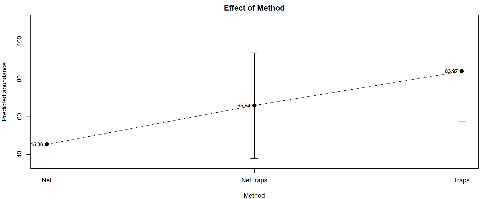

**Title:** ***Ecological Drivers effect on the Abundance of Bees***

**Introduction:**

Bees play a important role in maintaining the ecosystem by contributing to pollination, which supports the plant reproduction and eventually influence the biodiversity and productivity. So, understanding their population is vital in the context of ecosystem. While looking into the bee's abundance, the various ecological factors were essential to consider, especially in the regions were there more habitat alternation and climate variation.

To understand the bee adundance, *Eulaema nigrita* a bee species was undertaken for this study. It is a widely spread orchid bee known for its effective role as pollinators in tropical mountain environments.

In nature, ecological factors like rain, seasons and altitude affects their living by having influence on temperature, precipitation, and resource availability, etc. In this study, we considered several factors like sampling efforts, altitude, mean annual precipitation and temperature (MAP & MAT), temperature seasonality (Tseason), precipirtation seasonality (Pseason), forest cover propoetion (forest.), sampling method and land-use heterogeneity (lu_het).

To statistically evaluate the effect of these factors on bee abundance, the generalized linear model (GLM) is used. The abundance (response variable) was disrete count (skewed), but the linear model needs to be continous, so that, the linear model is unsuitable. Then, GLM doesn't asssume to be normally distributed when compare to the linear models. The poisson or negative binomial distribution (NB) is considered for the this data because the response variable was counts. This allow researchers to analyze the non-nornmal data while accounting for mean-variance relationship. 

This study includes both the poisson and negative binomial distribution. Due to overdispersion of the data, the negative binomial distribution is used. This approach helps to identify the key environmental drivers associated with increase or decrease in the bee abundance.

**Method:**

The Generalized Linear Model (GLM) using poisson and negative binomial distribution (NB) works on the idea of clssical linear regression, but doesn't assume that residuals to be normally distributed. The GLM can be done for both linear and multiple regression beased on the availability of the predictor variables. This distribution uses a link function with the linear predictor, here it is log function.

```
λ = β0​ + β1​X1 + β2​X2 + .. + βnXn

log(Y) = λ

Y = exp(λ)
```
The model uses the log scale, so the prediction will be straight, with the estimates in expontent. The poisson assume that mean and variance were equal but NB assumes variance is greater than mean.
```
Poisson model:
       Variance = Mean
NB model:
       Variance > Mean
```
Before starting with the model, first the predictor variables need to be choosen in both biological and mathematical aspects. 

While looking into the data, climatic variables like MAT (°C), MAP (mm), Pseason and Tseason has high influence on the bee activity and survival. Then land mass also plays a important role, because the heterogeneity and forest cover helps the bees to forage and nesting in the habitat. Further, here the bee abundance is counted by capturing it through traps, nets, etc, with respective sampling time (hrs). These can increase or drease the count as well.

The mathematical ideaology can be helpful to reduce some variable to avoid overfitting. First, consider on the correlation to remove variables which has same values. Then can think of backward and forward selection, which predicts the good model and also by using dredge function in R using library MUMIn for finding possible predictor variables based on the AIC scores.

Once the predictor variables were fixed then the GLM is used for understanding the role of various variables towards abundance. 

**Results:**

*Data Visualization:*

Initially, the data was visuallized through plots like boxplot or histogram to understand how the data is distributed. Figure 1 shows how the response and predictor variable is spread out in the data. From the histogram of response variable is clearly seen that the counts were skewed. Then the boxplot shows the spread out of the predictor variables. The variables like effort, altitude and MAP shows outliers which indicates that these variation might have a significant effect on the response variable, which doesn't mean that others don't have any effect on the response. The most of the median lies at the center, near zero. So there is no much variation between the variables.


*Figure 1: Visualization of the bee distribution data for both response and predictor variables, with boxplot and histogram.*

*Selection of Predictors:*

The predictor variabes were subjected to correlation test for identifying the correlation between the variables. It was found that altitude and MAT has negative correlation of -0.8400517 (85%), which means as the altitude increases the temperature decreases. So, one of the variable is excluded from the model. 

*(i) Biologically:* The precipition has a indirect effect on the bee count, which affects the food resourses, nesting, etc. Both Pseason and Tseason has a important role. Then forest cover proportion gives a brief idea, if the area increases then the availability of resources and population increases than the land-use heterogeneity. Because of heterogeneity in the land-use can be separation of habitat. 

Basically, the *Eulaema nigrita* lives in the tropical mountains, so the altitude don't have much effect on it. Then the sampling methods have some importance because it varies based what equipment is used. But the effort (time) doesn't tells anything because more time we might result in getting more counts.
Based on the selection of variables, the constructed poisson GLM is given by,

```
model = glm(Eulaema_nigrita ~ MAP+Tseason+
                  Pseason+forest.+factor(method), 
                family = poisson(link = "log"), data = data_clean, na.action = 'na.fail')
```
This model has overdispersion, which was identified from the null and residual deviance of 23280 and 15760 respectively, which is more than 5x times the degree of freedom. This overdispersion happens because of the assumption of mean = variance. To overcome the problem, the negative binomial distribution is used. 
```
nb_model = glm.nb(Eulaema_nigrita ~ MAP+Tseason+
                  Pseason+forest.+factor(method), 
                 data = data_clean, na.action = 'na.fail')
```
Now, the null and residual deviance is reduced to 319.71 and 208.19. We can compute Pseudo-R² for knowing how much better the model fits the data compared to the null model.
```
Pseudo-R² = 1 - Residual Deviance/Null Deviance
```
The Pseudo-R² was 0.346 (30%) of variation is explained relative to the null model. If model is more closer to null model then it will be equal to zero. This confirm that the model is considerable for the data used. Then the real abundance and predicted abundance also compared, which gives an idea of how the model prediction was. The figure 2 shows that most of the values were near the red line. We can say a perfect prediction when both has same values (predicted = observed) which is (y=x).
So that the model explain the data in good way.


*Figure 2: Observed vs predicted plot, the red line was y=x which means the observed and predicted values were equal. This explains how much the model predicted relative to the observed values.*


The model estimates for the variables were significant but we can also check that the variables fit the model using backward and dredge function.

Both the selection showed that AIC were approximately to 1814. Table 1 shows that the all variables in the model are important, even removing one variable significantly increasing the AIC scores in backward selection.
```
Backward selection:
     back_model = step(nb_model, direction = 'backward')

Dredge model selection:
     m1 = dredge(nb_model)
```
**Table 1:** *Backward selection*

| Predictor        | Df  | Deviance | AIC    |
|:-----------------|:---:|:--------:|:------:|
| <none>           | -   | 208.21   | 1813.0 |
| Tseason          | 1   | 214.87   | 1817.7 |
| factor(method)   | 2   | 218.41   | 1819.2 |
| forest.          | 1   | 216.65   | 1819.5 |
| Pseason          | 1   | 229.52   | 1832.3 |
| MAP              | 1   | 237.95   | 1840.8 |

The AIC score 1813 is low value, which means best model, but removing one variable eventually increases the AIC scores.
Df - Degree of Freedom; AIC - Akaike Information Criterion.


*Effect of predictors:*

From the Table 2 of coefficients, it clearly explains how each variable affects the response variable, abundance. Initially, the MAP has estimate around -0.0012 (percentage change = exp(estimates)-1*100) which has high significant p-value. But the negative sign indicates that for each unit of MAP decreases the abundance by 0.12%. Tseason has -0.0004 which significantly explains that high variation in the temperature reduce abundance by 0.04%. Pseason significantly increase the abundance by 1.99% whcih indicate that higher precipitation variation can helps the bee counts to increase.

**Table 2:** *Coefficients of the predictor variable*

| Predictor        | Estimate | Std_Error | Z_value | P_value   | Percent_Change | Significance |
|:-----------------|:--------:|:---------:|:-------:|:---------:|:--------------:|:------------:|
| MAP              | -0.0012  | 0.000227  | -5.364  | 8.12e-08  | -0.12%         | ***          |
| Tseason          | -0.0004  | 0.000159  | -2.517  | 0.0118    | -0.04%         | *            |
| Pseason          | 0.0195   | 0.00412   | 4.743   | 2.10e-06  | +1.99%         | ***          |
| forest.          | -0.9735  | 0.3214    | -3.029  | 0.00245   | -37.7%         | **           |
| method: NetTraps | 0.3740   | 0.2470    | 1.514   | 0.1300    | +45.4%         |              |
| method: Traps    | 0.6158   | 0.1985    | 3.101   | 0.00193   | +85.1%         | **           |

**Notes:** Percent change calculated from exponentiated coefficients. P-values indicate significance levels.  
Significance codes: 0 '\*\*\*' 0.001 '\*\*' 0.01 '\*' 0.05 '.' 0.1 ' ' 1

The variables were kept contants when one variable is checked for the trend to see whether it is following the real data or not. Figure 3 shows the effect of each variables when others kept constant.


*Figure 3: Effect of each variables when other variable is kept contstant by using their mean. All of the variable follow the trend with the observed values.*

Forest cover proportion reduces the abundance of bees by 37.7% which high when compare to other variables. Followed by sampling methods, Net traps was not significant in capturing the counts, but increases the abundance by 45%. Then traps was significant compare to net traps of estimate 0.615 which is 85.1% increase in bee count for every one unit increase in the traps. The figure 4 shows that traps has influence on the abundance with prediction of 83.97 when the other variables kept constant. These two methods were compared with the baseline or reference to hand nets.


*Figure 4: Effect of methods like traps, net traps, nets for capturing the abundance. The traps relatively increase the abundance.*


**Conclusion:**

This study demonstrates that *Eulaema nigrita* abundance is strongly influenced by climatic and landscape gradients. Higher precipitation seasonality promotes abundance, while high MAP and high temperature seasonality reduce it. Eventhough both MAP and Pseason talks about the precipitation they differs, because Pseason (variation in precipitation or wet environment) increase then there is more variation in the habitat towards precipitation which helps the floral diversity and eventually increase the bee abundance by foraging, shelter and resourse availability. But MAP (annual rainfall) increases then it affects both bees and floral resource too. 

Forest cover is negatively associated with observed bee counts, potentially the bees prefers a open area landscape which doesn't need to be surrounded by forest area. Sampling method also significantly affects abundance estimates, which gives an insight that methodological differences also plays a important role with the ecological studies.

**R-code:**

```
                """Generalized Linear Model - Poisson & Negative Binomial Distribution"""

#This scripts work for GLM - NB for bee abundance;
#The aim of this study to understand the abundance of bee is affected by which factors;
#The data contains the abundance of bee with the various predictor variables;

#load the library;
library(MuMIn)  #for model selection;
library(MASS)   #for negative binomial dist;
library(caret)  #for correlation identification;              
              
#Step 1:
# If the files in other directory, mention the directory first;
data_1 = read.csv("Eulaema.csv")

#Step 2:
#Visualization of data;
#to undertand how the data is spread out;
summary(data_1$Eulaema_nigrita)

par(mfrow = c(1,2))
#boxplot for the predictor variables;
#The variable were scaled to mean 0 and sd 1;
#To have similar scale;
boxplot(
  list(
    effort = as.numeric(scale(data_1$effort)),
    altitude  = as.numeric(scale(data_1$altitude)),
    MAT  = as.numeric(scale(data_1$MAT)),
    MAP = as.numeric(scale(data_1$MAP)),
    Tseason  = as.numeric(scale(data_1$Tseason)),
    Pseason  = as.numeric(scale(data_1$Pseason)),
    forest  = as.numeric(scale(data_1$forest.)),
    lu_het  = as.numeric(scale(data_1$lu_het))),
  las = 2,
  cex.axis = 0.7, main = 'Boxplot of predictor variables',
  xlab = 'predictor variables', ylab = 'Scaled values')

#histogram of the response variable;
hist(data_1$Eulaema_nigrita, main = 'histogram of response variable',
     xlab = 'abundance of Eulaema nigrita')

#Step 3:
#selection of predictor variables;

#1) correlation test:
variables = data_1[, c("effort","altitude","MAT",
                       "MAP","Tseason","Pseason",
                       "forest.","lu_het")]
cor_result = cor(scale(data_1[, c("effort","altitude","MAT",
                                  "MAP","Tseason","Pseason",
                                  "forest.","lu_het")]), use="pairwise.complete.obs")

#to find the high correlation ones among the grps;
high_corr <- as.numeric(findCorrelation(cor_result, cutoff = 0.8))

#extracting the column which has more correlation;
variables[,high_corr, drop = F]
#column name of that variables;
colnames(variables[,high_corr, drop = F])
#creating a new dataframe which doesn't contain the highly correlated variable;
data_new = data_1[, !names(data_1) %in% colnames(variables[,high_corr, drop = F])]
#clean the data to avoid the na in it;
data_clean <- na.omit(data_new)

#check for removal of NAs 
all(!is.na(data_clean))     #TRUE

#2) by biology: MAP, Tseason, Pseason, forest, methods might has high role than the other predictors;

#Step 4:
#Poisson model;
model = glm(Eulaema_nigrita ~ MAP+Tseason+
              Pseason+forest.+factor(method), 
            family = poisson(link = "log"), data = data_clean, na.action = 'na.fail')

#the poisson model has overdispersion;
#which was identified from the null and residual deviance of 23280 and 15760 respectively
#which is more than 5x times the degree of freedom.

#Step 5:
#Negative binomial distribution:
nb_model = glm.nb(Eulaema_nigrita ~ MAP+Tseason+
                    Pseason+forest.+factor(method), 
                  data = data_clean, na.action = 'na.fail')

#checking the pseudo-R square;
#tells how variation is explained by the model relative to the null model;
1-(nb_model$deviance/nb_model$null.deviance)

#Step 6:
#checking for the variable fit in the model;
#backward selection;
back_model = step(nb_model, direction = 'backward')
#by dredge function;
m1 = dredge(nb_model)

#Step 7:
#checking for each individual variables;
#how the trend is?
#by keeping the other variables constant;

#before that convert the methods to factor;
data_clean$method <- factor(data_clean$method)

#List of predictors to plot;
predictors = c("MAP", "Tseason", "Pseason", "forest.")

#Choose the most common method;
common_method = names(sort(table(data_clean$method), decreasing = TRUE))[1]

#Set up a 2x2 plotting grid;
#2 rows, 2 columns, adjust margins;
par(mfrow = c(2, 2), mar = c(4, 4, 2, 1))  

#Function to generate prediction plot for a single predictor;
plot_predictor = function(model, data, predictor, common_method) {
  
  #Sequence of values for the predictor;
  pred_seq = seq(min(data[[predictor]], na.rm = TRUE),
                  max(data[[predictor]], na.rm = TRUE), length.out = 200)
  
  #Create new data frame with other predictors fixed at mean;
  newdata = data.frame(
    MAP = rep(mean(data$MAP, na.rm = TRUE), 200),
    Tseason = rep(mean(data$Tseason, na.rm = TRUE), 200),
    Pseason = rep(mean(data$Pseason, na.rm = TRUE), 200),
    forest. = rep(mean(data$forest., na.rm = TRUE), 200),
    method = factor(rep(common_method, 200), levels = levels(data$method)))
  
  #Replace the predictor column with the sequence
  newdata[[predictor]] = pred_seq
  
  #Get predictions with standard errors;
  y_hat = predict(model, newdata = newdata, type = "response", se.fit = TRUE)
  upper = y_hat$fit + 1.96 * y_hat$se.fit
  lower = y_hat$fit - 1.96 * y_hat$se.fit
  
  #Plot predicted abundance with confidence intervals;
  plot(data[[predictor]],data$Eulaema_nigrita,
       xlab = predictor, ylab = "Predicted abundance",
       main = paste("Effect of", predictor), pch =16)
  lines(pred_seq, y_hat$fit, lwd = 2)
  lines(pred_seq, upper, lty = 2)
  lines(pred_seq, lower, lty = 2)
  polygon(c(pred_seq, rev(pred_seq)),
          c(y_hat$fit+1.96*y_hat$se.fit,
            rev(y_hat$fit-1.96*y_hat$se.fit)),
          col = rgb(0,1,0,.5), border = FALSE)
}

#Loop through all predictors;
for (pred in predictors) {
  plot_predictor(nb_model, data_clean, pred, common_method)
}

#Reset plotting layout to default
par(mfrow = c(1,1))

#for the methods;
#setting the variables to constant;
newMAP = mean(data_clean$MAP, na.rm = TRUE)
newTseason = mean(data_clean$Tseason, na.rm = TRUE)
newPseason = mean(data_clean$Pseason, na.rm = TRUE)
newForest  = mean(data_clean$forest., na.rm = TRUE)

#Levels of the categorical variable;
method_levels = levels(data_clean$method)

#Create new data frame for prediction;
newdata_method = data.frame(
  MAP     = rep(newMAP, length(method_levels)),
  Tseason = rep(newTseason, length(method_levels)),
  Pseason = rep(newPseason, length(method_levels)),
  forest. = rep(newForest, length(method_levels)),
  method  = factor(method_levels, levels = method_levels))

#Get predictions;
y_hat_method = predict(nb_model, newdata = newdata_method, type = "response", se.fit = TRUE)
upper = y_hat_method$fit + 1.96 * y_hat_method$se.fit
lower = y_hat_method$fit - 1.96 * y_hat_method$se.fit

plot(1:length(method_levels), y_hat_method$fit, type = "b", pch = 16, cex = 1.5,
     ylim = c(min(lower), max(upper)),
     xaxt = "n", xlab = "Method", ylab = "Predicted abundance",
     main = "Effect of Method")
axis(1, at = 1:length(method_levels), labels = method_levels)
text(1:length(method_levels), y_hat_method$fit, 
     labels = round(y_hat_method$fit,2),
     pos = 2, cex = 0.8)
arrows(1:length(method_levels), lower, 1:length(method_levels), upper,
       angle = 90, code = 3, length = 0.1)

#Step 8:
#Observed vs Predicted;
#y=x concept;
plot(data_clean$Eulaema_nigrita,fitted(nb_model),
     xlab = "Observed abundance", ylab = "Predicted abundance",
     main = "Observed vs Predicted counts",
     pch = 16, col = rgb(0,0,1,0.5))
abline(0,1, col = 'red',
       lwd =2)
```
